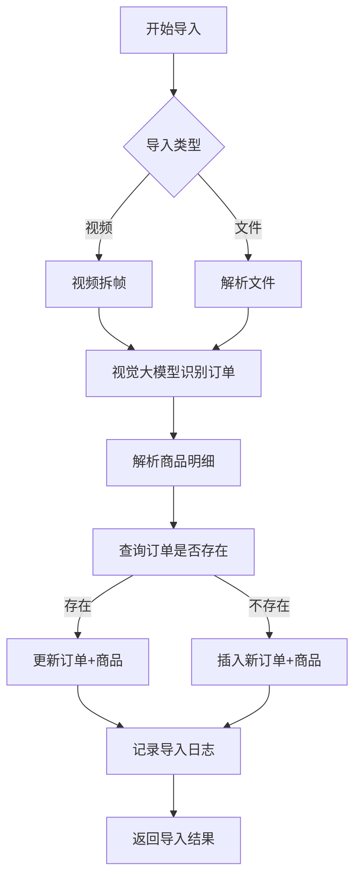

# 视频订单提取器 - 数据持久化与商品记录管理设计文档

## 1. 需求分析

### 1.1 需求一：数据持久化与增量导入

| 需求点 | 描述 | 优先级 |
| :--- | :--- | :--- |
| 数据持久化 | 当前数据仅在内存中临时存储，关闭应用后丢失，需要持久化存储 | 高 |
| 增量导入 | 用户需要随时间进度增量导入新的订单记录（视频或文件） | 高 |
| 数据去重 | 相同订单号不应重复存储 | 高 |
| 数据追溯 | 保留导入历史，支持数据审计 | 中 |

### 1.2 需求二：商品记录管理与多维度分析

| 需求点 | 描述 | 优先级 |
| :--- | :--- | :--- |
| 商品记录提取 | 需要从订单中提取商品明细（商品名称、数量、单价等） | 高 |
| 多维度分析 | 支持按商品类别、品牌、时间等维度进行分析 | 高 |
| 订单-商品关联 | 建立订单与商品的关联关系 | 高 |
| 商品分类管理 | 支持商品分类标签 | 中 |

---

## 2. 架构设计

### 2.1 整体架构

```
┌─────────────────────────────────────────────────────────────────┐
│                        应用层 (GUI)                             │
│  ┌──────────────┐  ┌──────────────┐  ┌──────────────────────┐   │
│  │ 视频处理模块  │  │ 文件导入模块  │  │   数据分析模块      │   │
│  └──────┬───────┘  └──────┬───────┘  └──────────┬───────────┘   │
└─────────┼─────────────────┼──────────────────────┼───────────────┘
          │                 │                      │
          ▼                 ▼                      ▼
┌─────────────────────────────────────────────────────────────────┐
│                      业务逻辑层                                 │
│  ┌──────────────┐  ┌──────────────┐  ┌──────────────────────┐   │
│  │ 订单解析服务  │  │ 数据去重服务  │  │   商品分析服务      │   │
│  └──────┬───────┘  └──────┬───────┘  └──────────┬───────────┘   │
└─────────┼─────────────────┼──────────────────────┼───────────────┘
          │                 │                      │
          ▼                 ▼                      ▼
┌─────────────────────────────────────────────────────────────────┐
│                      数据访问层 (DAO)                            │
│  ┌──────────────┐  ┌──────────────┐  ┌──────────────────────┐   │
│  │ OrderDAO     │  │ ProductDAO   │  │   ImportLogDAO      │   │
│  └──────┬───────┘  └──────┬───────┘  └──────────┬───────────┘   │
└─────────┼─────────────────┼──────────────────────┼───────────────┘
          │                 │                      │
          ▼                 ▼                      ▼
┌─────────────────────────────────────────────────────────────────┐
│                  数据库层 (SQLite)                              │
│  ┌───────────────────┐  ┌───────────────────┐  ┌─────────────┐   │
│  │      orders       │  │    products       │  │ import_logs │   │
│  └───────────────────┘  └───────────────────┘  └─────────────┘   │
│  ┌───────────────────┐  ┌───────────────────┐                   │
│  │   order_products  │  │   categories      │                   │
│  └───────────────────┘  └───────────────────┘                   │
└─────────────────────────────────────────────────────────────────┘
```

### 2.2 技术选型

| 分类 | 技术 | 版本 | 选型理由 |
| :--- | :--- | :--- | :--- |
| 数据库 | SQLite | 3.x | 轻量级嵌入式数据库，无需额外服务，适合桌面应用场景 |
| ORM | SQLAlchemy | 2.x | 成熟稳定的Python ORM，支持SQLite，便于数据迁移和维护 |
| 数据格式 | JSON | - | 用于临时数据交换和导出 |
| 视觉识别 | 视觉大模型（多模态大模型） | - | 通过视频拆帧后调用图片识别大模型提取订单信息，支持复杂场景的图文理解 |

---

## 3. 数据库设计

### 3.1 实体关系图 (ERD)

```
orders ──────────────────────────┐
  │                             │
  │ 1:N                         │
  ▼                             │
order_products ◄────────────────┤
  │                             │
  │ N:1                         │
  ▼                             │
products ───────────────────────┤
  │                             │
  │ N:1                         │
  ▼                             │
categories                      │
                                │
import_logs ────────────────────┘
```

### 3.2 数据表设计

#### 3.2.1 orders 表（订单主表）

| 字段名 | 类型 | 约束 | 说明 |
| :--- | :--- | :--- | :--- |
| id | INTEGER | PRIMARY KEY AUTOINCREMENT | 订单自增ID |
| order_id | VARCHAR(64) | UNIQUE NOT NULL | 外部订单编号（去重依据） |
| status | VARCHAR(32) | NOT NULL | 订单状态（已完成、已退款、待付款等） |
| datetime | DATETIME | NOT NULL | 下单时间/交易时间 |
| amount | DECIMAL(10,2) | NOT NULL | 订单金额（退款为负数） |
| tags | TEXT | NULL | 标签（如"亲友卡"等） |
| platform | VARCHAR(32) | NULL | 平台标识（线下/线上） |
| location | VARCHAR(64) | NULL | 交易地点/卖场（如"深圳"） |
| member_card | VARCHAR(32) | NULL | 会员卡号 |
| subtotal | DECIMAL(10,2) | NULL | 商品总计 |
| discount | DECIMAL(10,2) | NULL | 促销折扣 |
| rebate | DECIMAL(10,2) | NULL | 消费返利 |
| tax_excluded | DECIMAL(10,2) | NULL | 未税价格 |
| actual_pay | DECIMAL(10,2) | NULL | 实际支付金额 |
| raw_data | TEXT | NULL | 原始解析数据（JSON格式，用于追溯） |
| created_at | DATETIME | DEFAULT CURRENT_TIMESTAMP | 创建时间 |
| updated_at | DATETIME | DEFAULT CURRENT_TIMESTAMP | 更新时间 |

**索引设计：**
- `idx_orders_order_id` UNIQUE ON order_id（去重查询）
- `idx_orders_datetime` ON datetime（时间范围查询）
- `idx_orders_status` ON status（状态筛选）
- `idx_orders_location` ON location（地点筛选）

#### 3.2.2 products 表（商品信息表）

| 字段名 | 类型 | 约束 | 说明 |
| :--- | :--- | :--- | :--- |
| id | INTEGER | PRIMARY KEY AUTOINCREMENT | 商品自增ID |
| product_name | VARCHAR(255) | NOT NULL | 商品名称 |
| category_id | INTEGER | FOREIGN KEY | 关联分类ID |
| brand | VARCHAR(64) | NULL | 品牌名称 |
| unit_price | DECIMAL(10,2) | NULL | 参考单价 |
| image_url | VARCHAR(512) | NULL | 商品图片URL |
| barcode | VARCHAR(64) | NULL | 商品条码 |
| created_at | DATETIME | DEFAULT CURRENT_TIMESTAMP | 创建时间 |
| updated_at | DATETIME | DEFAULT CURRENT_TIMESTAMP | 更新时间 |

**索引设计：**
- `idx_products_name` ON product_name（商品名称搜索）
- `idx_products_category` ON category_id（分类查询）

#### 3.2.3 order_products 表（订单商品关联表）

| 字段名 | 类型 | 约束 | 说明 |
| :--- | :--- | :--- | :--- |
| id | INTEGER | PRIMARY KEY AUTOINCREMENT | 关联记录ID |
| order_id | INTEGER | FOREIGN KEY NOT NULL | 关联订单ID |
| product_id | INTEGER | FOREIGN KEY NOT NULL | 关联商品ID |
| quantity | INTEGER | NOT NULL DEFAULT 1 | 数量 |
| unit_price | DECIMAL(10,2) | NOT NULL | 实际单价 |
| subtotal | DECIMAL(10,2) | NOT NULL | 小计金额 |
| spec | VARCHAR(255) | NULL | 规格描述（如"大份"、"微辣"） |

**索引设计：**
- `idx_order_products_order` ON order_id（订单商品查询）
- `idx_order_products_product` ON product_id（商品销售统计）

#### 3.2.4 categories 表（商品分类表）

| 字段名 | 类型 | 约束 | 说明 |
| :--- | :--- | :--- | :--- |
| id | INTEGER | PRIMARY KEY AUTOINCREMENT | 分类自增ID |
| name | VARCHAR(64) | UNIQUE NOT NULL | 分类名称 |
| parent_id | INTEGER | FOREIGN KEY NULL | 父分类ID（支持多级分类） |
| level | INTEGER | DEFAULT 1 | 分类层级 |
| sort_order | INTEGER | DEFAULT 0 | 排序序号 |

**索引设计：**
- `idx_categories_parent` ON parent_id（层级查询）

#### 3.2.5 import_logs 表（导入记录表）

| 字段名 | 类型 | 约束 | 说明 |
| :--- | :--- | :--- | :--- |
| id | INTEGER | PRIMARY KEY AUTOINCREMENT | 记录ID |
| import_type | VARCHAR(32) | NOT NULL | 导入类型（video/file） |
| source_name | VARCHAR(255) | NOT NULL | 来源文件名/视频名 |
| total_records | INTEGER | DEFAULT 0 | 解析到的记录总数 |
| new_records | INTEGER | DEFAULT 0 | 新增记录数 |
| update_records | INTEGER | DEFAULT 0 | 更新记录数 |
| duplicate_records | INTEGER | DEFAULT 0 | 重复记录数 |
| status | VARCHAR(32) | NOT NULL | 状态（success/failed） |
| error_message | TEXT | NULL | 错误信息 |
| created_at | DATETIME | DEFAULT CURRENT_TIMESTAMP | 导入时间 |

**索引设计：**
- `idx_import_logs_type` ON import_type（按类型统计）
- `idx_import_logs_time` ON created_at（时间范围查询）

---

## 4. 核心功能设计

### 4.1 数据持久化流程

```
┌──────────────┐     ┌──────────────────────┐     ┌──────────────┐
│  数据来源    │ ──► │    数据解析         │ ──► │  数据去重    │
│ (视频/文件)  │     │ (视觉大模型/JSON)   │     │  (订单号)    │
└──────────────┘     └──────────────────────┘     └──────┬───────┘
                                                         │
                         ┌───────────────────────────────┴───────────────────────┐
                         ▼                                                       ▼
                   ┌───────────┐                                           ┌───────────┐
                   │  新增订单  │                                           │  更新订单  │
                   │ (INSERT)  │                                           │ (UPDATE)  │
                   └─────┬─────┘                                           └─────┬─────┘
                         │                                                       │
                         ▼                                                       ▼
                   ┌───────────────────────────────────────────────────────────────┐
                   │                    orders 表                                 │
                   └───────────────────────────────────────────────────────────────┘
```

### 4.2 增量导入机制

**增量导入策略：**

| 策略类型 | 实现方式 | 说明 |
| :--- | :--- | :--- |
| 基于订单号去重 | UNIQUE约束 + INSERT OR REPLACE | 相同订单号自动覆盖更新 |
| 时间戳记录 | 记录最后导入时间 | 支持按时间范围增量导入 |
| 来源追溯 | import_logs表记录 | 记录每次导入的来源和结果 |

**导入流程：**



### 4.3 商品记录提取

**视觉大模型提示词（包含商品信息）：**

```json
{
  "order_id": "订单编号（完整数字串）",
  "status": "订单状态（如已完成、已退款）",
  "datetime": "下单时间/交易时间（格式 YYYY/MM/DD HH:MM:SS）",
  "amount": "订单金额（数字，退款为负数）",
  "location": "交易地点/卖场（如深圳）",
  "member_card": "会员卡号",
  "tags": "标签（如亲友卡，没有则为空字符串）",
  "subtotal": "商品总计",
  "discount": "促销折扣",
  "rebate": "消费返利",
  "tax_excluded": "未税价格",
  "actual_pay": "实际支付金额",
  "products": [
    {
      "product_name": "商品名称",
      "quantity": "数量（整数）",
      "unit_price": "单价",
      "spec": "规格描述（如330ml*30）",
      "subtotal": "小计金额"
    }
  ]
}
```

**支持的两种图片格式：**

| 图片类型 | 提取内容 | 说明 |
| :--- | :--- | :--- |
| **我的订单列表页** | 订单编号、状态、下单时间、金额、地点 | 一次识别多条订单概览 |
| **订单详情页** | 订单编号、状态、交易时间、会员卡号、商品明细列表、各项费用明细 | 单条订单的完整信息 |

**商品匹配策略：**

| 匹配方式 | 优先级 | 说明 |
| :--- | :--- | :--- |
| 精确匹配 | 1 | 商品名称完全一致 |
| 模糊匹配 | 2 | 商品名称相似度 > 80% |
| 新商品创建 | 3 | 无法匹配时创建新商品记录 |

---

## 5. 多维度分析设计

### 5.1 分析维度

| 维度 | 分析指标 | 实现方式 |
| :--- | :--- | :--- |
| 时间维度 | 月度消费趋势、周对比、日分析 | GROUP BY datetime |
| 商品维度 | 销量排行、销售额占比、复购分析 | JOIN products |
| 分类维度 | 分类消费占比、热门分类 | JOIN categories |
| 平台维度 | 各平台消费对比 | GROUP BY platform |
| 标签维度 | 亲友卡消费统计 | WHERE tags LIKE '%亲友卡%' |

### 5.2 分析报表

| 报表名称 | 描述 | 数据来源 |
| :--- | :--- | :--- |
| 月度消费趋势 | 按月统计消费金额、订单数 | orders + order_products |
| 商品销售排行 | 商品销量TOP10、销售额TOP10 | order_products + products |
| 分类消费占比 | 各分类消费金额占比 | products + categories |
| 订单统计概览 | 总订单数、完成率、退款率 | orders |
| 导入历史记录 | 各次导入的统计信息 | import_logs |

---

## 6. 数据访问层设计

### 6.1 DAO接口设计

#### OrderDAO

| 方法名 | 功能描述 | 参数 | 返回值 |
| :--- | :--- | :--- | :--- |
| `get_by_order_id(order_id)` | 按订单号查询 | order_id: str | Order对象或None |
| `get_by_time_range(start, end)` | 按时间范围查询 | start: datetime, end: datetime | Order列表 |
| `get_by_status(status)` | 按状态查询 | status: str | Order列表 |
| `create(order_data)` | 创建订单 | order_data: dict | Order对象 |
| `update(order_id, data)` | 更新订单 | order_id: str, data: dict | 更新行数 |
| `upsert(order_data)` | 插入或更新 | order_data: dict | Order对象 |
| `delete(order_id)` | 删除订单 | order_id: str | 删除行数 |
| `get_summary(start, end)` | 获取订单汇总 | start: datetime, end: datetime | 汇总字典 |

#### ProductDAO

| 方法名 | 功能描述 | 参数 | 返回值 |
| :--- | :--- | :--- | :--- |
| `get_by_id(product_id)` | 按ID查询 | product_id: int | Product对象或None |
| `get_by_name(product_name)` | 按名称查询 | product_name: str | Product对象或None |
| `search_by_name(keyword)` | 模糊搜索名称 | keyword: str | Product列表 |
| `get_by_category(category_id)` | 按分类查询 | category_id: int | Product列表 |
| `create(product_data)` | 创建商品 | product_data: dict | Product对象 |
| `update(product_id, data)` | 更新商品 | product_id: int, data: dict | 更新行数 |
| `get_sales_ranking(limit)` | 获取销量排行 | limit: int | 商品销售排行列表 |

#### ImportLogDAO

| 方法名 | 功能描述 | 参数 | 返回值 |
| :--- | :--- | :--- | :--- |
| `create(log_data)` | 创建导入日志 | log_data: dict | ImportLog对象 |
| `get_by_time_range(start, end)` | 按时间范围查询 | start: datetime, end: datetime | ImportLog列表 |
| `get_by_type(import_type)` | 按类型查询 | import_type: str | ImportLog列表 |
| `get_summary()` | 获取导入汇总 | - | 汇总字典 |

---

## 7. 目录结构设计

```
video-order-extractor/
├── src/                              # 核心源代码
│   ├── __init__.py
│   ├── core/                         # 核心模块
│   │   ├── __init__.py
│   │   ├── config.py                 # 配置管理
│   │   ├── prompts.py                # 提示词模板
│   │   └── exceptions.py             # 自定义异常
│   ├── video/                        # 视频处理模块
│   │   ├── __init__.py
│   │   ├── extractor.py              # 视频拆帧
│   │   ├── recognizer.py             # 视觉识别
│   │   ├── deduplicator.py           # 数据去重
│   │   ├── aggregator.py             # 数据汇总
│   │   └── processor.py              # 视频处理主流程
│   ├── excel/                        # Excel生成模块
│   │   ├── __init__.py
│   │   └── generator.py              # Excel报表生成
│   ├── database/                     # 数据库管理
│   │   ├── __init__.py
│   │   └── connection.py             # 数据库连接
│   ├── models/                       # 数据库模型
│   │   ├── __init__.py
│   │   ├── order.py                  # 订单模型
│   │   ├── product.py                # 商品模型
│   │   ├── order_product.py          # 订单商品关联模型
│   │   ├── category.py               # 分类模型
│   │   └── import_log.py             # 导入日志模型
│   ├── dao/                          # 数据访问层
│   │   ├── __init__.py
│   │   ├── order_dao.py              # 订单数据访问
│   │   ├── product_dao.py            # 商品数据访问
│   │   ├── order_product_dao.py      # 订单商品关联数据访问
│   │   ├── category_dao.py           # 分类数据访问
│   │   └── import_log_dao.py         # 导入日志数据访问
│   └── services/                     # 业务服务层
│       ├── __init__.py
│       ├── product_service.py        # 商品业务服务
│       └── import_service.py         # 导入业务服务
├── gui/                              # GUI模块
│   ├── __init__.py
│   ├── widgets/                      # UI组件
│   │   └── __init__.py
│   └── threads/                      # 后台线程
│       └── __init__.py
├── tests/                            # 测试文件
│   ├── unit/                         # 单元测试
│   └── integration/                  # 集成测试
├── scripts/                          # 启动脚本
│   ├── run_gui.py                    # 启动GUI
│   └── run_api.py                    # 启动API服务
├── docs/                             # 文档目录
│   └── data_persistence_design.md    # 本设计文档
├── main.py                           # API入口
├── gui_app.py                        # GUI主程序
├── requirements.txt                  # 依赖清单
└── .env                              # 环境变量配置
```

---

## 8. 数据库迁移与初始化

### 8.1 初始化流程

```
首次启动应用
       │
       ▼
  检查数据库文件
       │
       ├── 存在 ──► 连接数据库
       │
       └── 不存在 ──► 创建数据库 ──► 创建表结构 ──► 初始化基础数据 ──► 连接数据库
```

### 8.2 基础数据初始化

**分类数据（categories表）：**

| name | parent_id | level | sort_order |
| :--- | :--- | :--- | :--- |
| 餐饮美食 | NULL | 1 | 1 |
| 外卖订餐 | 1 | 2 | 1 |
| 到店餐饮 | 1 | 2 | 2 |
| 生鲜水果 | NULL | 1 | 2 |
| 蔬菜水果 | 4 | 2 | 1 |
| 肉禽蛋品 | 4 | 2 | 2 |
| 日用百货 | NULL | 1 | 3 |
| 家居用品 | 7 | 2 | 1 |
| 个人护理 | 7 | 2 | 2 |
| 数码电子 | NULL | 1 | 4 |
| 服饰鞋包 | NULL | 1 | 5 |
| 其他 | NULL | 1 | 99 |

---

## 9. 安全性与数据完整性

### 9.1 数据完整性约束

| 约束类型 | 实现位置 | 说明 |
| :--- | :--- | :--- |
| UNIQUE约束 | orders(order_id) | 保证订单号唯一性 |
| FOREIGN KEY | order_products(order_id, product_id) | 维护关联关系 |
| NOT NULL | 关键字段 | 确保必填字段不为空 |
| CHECK约束 | amount > 0（商品） | 金额合法性校验 |

### 9.2 数据备份建议

| 策略 | 频率 | 方式 |
| :--- | :--- | :--- |
| 自动备份 | 每日 | 定时任务复制SQLite文件 |
| 手动导出 | 按需 | 导出为JSON/Excel格式 |
| 版本控制 | 按需 | 备份到外部存储 |

---

## 10. 性能优化考虑

### 10.1 查询优化

| 优化项 | 实现方式 |
| :--- | :--- |
| 索引优化 | 为常用查询字段创建索引 |
| 查询缓存 | 对统计查询结果进行缓存 |
| 分页查询 | 大数据量查询采用分页 |

### 10.2 批量操作

| 场景 | 优化策略 |
| :--- | :--- |
| 批量导入 | 使用批量INSERT语句 |
| 批量更新 | 使用UPDATE WHERE IN |
| 批量删除 | 使用DELETE WHERE IN |

---

## 11. 后续扩展计划

| 扩展项 | 描述 | 优先级 |
| :--- | :--- | :--- |
| 用户管理 | 支持多用户使用，数据隔离 | 中 |
| 数据同步 | 支持云存储备份（如阿里云OSS） | 低 |
| API接口 | 提供RESTful API供外部系统调用 | 低 |
| 数据可视化 | 增强图表展示功能 | 中 |

---

## 附录：实体类字段定义

### Order 实体

| 字段名 | 类型 | 含义 |
| :--- | :--- | :--- |
| id | int | 主键ID |
| order_id | str | 外部订单号（去重依据） |
| status | str | 订单状态（已完成、已退款等） |
| datetime | datetime | 下单时间/交易时间 |
| amount | float | 订单金额（退款为负数） |
| tags | str | 标签（如亲友卡） |
| platform | str | 平台标识（线下/线上） |
| location | str | 交易地点/卖场 |
| member_card | str | 会员卡号 |
| subtotal | float | 商品总计 |
| discount | float | 促销折扣 |
| rebate | float | 消费返利 |
| tax_excluded | float | 未税价格 |
| actual_pay | float | 实际支付金额 |
| raw_data | str | 原始解析数据（JSON格式） |
| created_at | datetime | 创建时间 |
| updated_at | datetime | 更新时间 |

### Product 实体

| 字段名 | 类型 | 含义 |
| :--- | :--- | :--- |
| id | int | 主键ID |
| product_name | str | 商品名称 |
| category_id | int | 分类ID |
| brand | str | 品牌 |
| unit_price | float | 参考单价 |
| image_url | str | 图片URL |
| barcode | str | 条码 |
| created_at | datetime | 创建时间 |
| updated_at | datetime | 更新时间 |

### OrderProduct 实体

| 字段名 | 类型 | 含义 |
| :--- | :--- | :--- |
| id | int | 主键ID |
| order_id | int | 订单ID |
| product_id | int | 商品ID |
| quantity | int | 数量 |
| unit_price | float | 单价 |
| subtotal | float | 小计 |
| spec | str | 规格 |

---

**文档版本**: v1.1  
**创建日期**: 2026-05-30  
**更新日期**: 2026-05-30  
**适用项目**: video-order-extractor  
**更新说明**: 根据实际订单截图修正数据模型，明确视觉大模型识别方式（非OCR），补充商品明细提取字段
